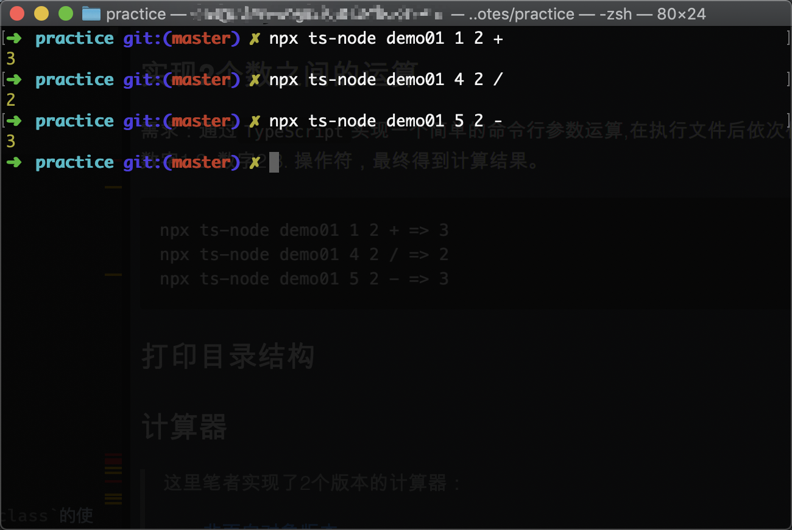
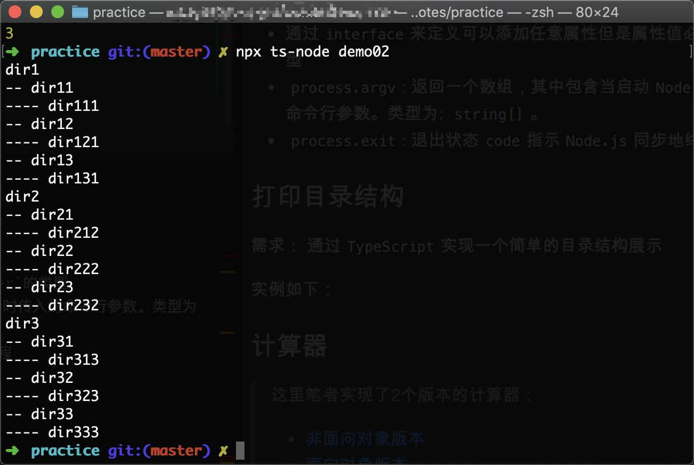

## 案例实践
这里我们会通过简单的小案例来复习巩固`TypeScript`中的一些常用语法，加深记忆，为之后的深入学习奠定基础。

### 实现2个数之间的运算
需求：通过`TypeScript`实现一个简单的命令行参数运算,在执行文件后依次传入三个参数： 1. 数字1 2. 数字2 3. 操作符，最终得到计算结果。
```npm
npx ts-node demo01 1 2 + => 3
npx ts-node demo01 4 2 / => 2
npx ts-node demo01 5 2 - => 3
```
  

代码如下：  
```typescript
const x: number = Number(process.argv[2]);
const y: number = Number(process.argv[3]);
const operator: string = process.argv[4];

interface ResultMap {
  [key: string]: number
}

const resultMap: ResultMap = {
  'x': x * y,
  '+': x + y,
  '-': x - y,
  '/': x / y
};
if (isNaN(x) || isNaN(y)) {
  console.log('请输入2个数字');
  // 失败退出,这里不能使用return
  process.exit(1);
}
if (!Object.keys(resultMap).includes(operator)) {
  console.log('请在第三个参数位置输入正确的操作符');
  process.exit(1);
}
if (operator === '/' && y === 0) {
  console.log('除数不能为0');
  // 失败退出进程
  process.exit(1);
}
console.log(resultMap[operator]);
// 成功退出
process.exit(0);
```

知识点小结：  
* `TypeScript`类型转换
* 通过`interface`来定义可以添加任意属性但是属性值必须是`number`的类型
* `process.argv`: 返回一个数组，其中包含当启动`Node.js`进行时传入的命令行参数。类型为: `string[]`。
* `process.exit`: 退出状态`code`指示`Node.js`同步地终止进程

### 打印目录结构
需求： 通过`TypeScript`实现一个简单的目录结构展示 

实例如下：


代码如下：  
```typescript
class Tree {
  name: string;
  subFiles: Tree[] = [];

  constructor (name: string) {
    this.name = name;
  }

  makeSubFile (child: Tree): void {
    this.subFiles.push(child);
  }

  display (n: number = 0): void {
    if (n === 0) {console.log(this.name);}
    n++;
    const prefix = '--'.repeat(n);
    this.subFiles.map(item => {
      console.log(`${prefix} ${item.name}`);
      item.display(n);
    });
  }
}

const createTree = (): void => {
  for (let i = 1; i < 4; i++) {
    const parent = new Tree(`dir${i}`);
    for (let j = 1; j < 4; j++) {
      const child = new Tree(`dir${i}${j}`);
      const subChild = new Tree(`dir${i}${j}${i}`);
      parent.makeSubFile(child);
      child.makeSubFile(subChild);
    }
    parent.display();
  }
};
createTree();
```  
知识点小结：  
> 这里的目录结构其实是自己写死的，有兴趣的小伙伴可以进行进一步的优化

* 用`class`来指定变量的类型
* `String.prototype.repeat`: 构造并返回一个新字符串，该字符串包含被连接在一起的指定数量的字符串的副本


### 计算器
[点击预览](https://wangkaiwd.github.io/typescript-notes/practice/index.html)

> 这里笔者实现了2个版本的计算器：  
> * [非面向对象版本](./demo03.ts)
> * [面向对象版本](./demo04.ts)
> 
> 这里讲的是面向对象版本的实现

这里我们通过使用面向对象实现一个简单的计算器来巩固我们在`TS`中`class`的使用以及`DOM`操作。

#### 配置代码编写环境
首先我们新建`index.html`页面来引入生成的`js`文件：  
```html
<!doctype html>
<html lang="zh">
<head>
  <meta charset="UTF-8">
  <meta name="viewport"
        content="width=device-width, user-scalable=no, initial-scale=1.0, maximum-scale=1.0, minimum-scale=1.0">
  <meta http-equiv="X-UA-Compatible" content="ie=edge">
  <title>Document</title>
</head>
<body>
<div class="calculator">

</div>
<script src="./demo04.js"></script>
</body>
</html>
```
接下来我们通过`tsc`命令来实时编译`demo04.ts`文件：  
```npm
npx tsc -w demo04.ts
```

这样我们就可以在`demo04.ts`中愉快的编写代码了。

#### 实战开始
在开始之前我们可以简单看下最终的效果：


由于`css`的编写不是我们学习的重点，这里我已经将`css`写好了，想要学习的小伙伴可以直接使用: [传送门](./index.html)

在我们使用计算器的时候希望通过如下代码来实现：  
```typescript
const calculator = new Calculator('.calculator');
```

根据这个思路，我们需要在定义的`class`中通过传入的字符串来获取到对应的`DOM`元素：  
```typescript
class Calculator {
  element: HTMLElement;

  constructor (selector: string) {
    this.element = document.querySelector<HTMLElement>(selector)!;
  }
}
```

这里小伙伴们可能会对`!`这个符号比较疑惑，在`ts`中在变量后边的`!`非空(`non-null`)断言操作符。有时候我们可以确认当前操作的值不会是`null`和`undefined`，但是编译器可能并不知道，它总是会考虑最全面的情况。这里我们通过`!`操作符来向编译器传达当前值不是`null`和`undefined`，编译器就不会再进行错误提示。
> 关于`stack overflow`的讨论可以看这里： https://stackoverflow.com/questions/43951090/typescript-object-is-possibly-null

接下来我们要把计算器中的按钮插入到页面中：  
```typescript
class Calculator {
  element: HTMLElement;
  textList: string[] = ['clear', '/', '7', '8', '9', 'x', '4', '5', '6', '-', '1', '2', '3', '+', '0', '.', '='];

  constructor (selector: string) {
    this.element = document.querySelector<HTMLElement>(selector)!;
    this.initButtons();
  }

  initButtons () {
    this.textList.forEach((text:string) => {
      this.createButton(text, `item-${text}`);
    });
  }

  createButton (text: string, className: string) {
    // 这里多创建一个div的目的是要通过padding来间隔子元素button
    const div: HTMLDivElement = document.createElement('div');
    const button: HTMLButtonElement = document.createElement('button');
    button.classList.add('button');
    button.innerText = text;
    div.classList.add('col', className);
    div.appendChild(button);
    this.element.appendChild(div);
  }
}
```

我们将计算器中的按钮定义为一个数组，然后遍历数组，将每个按钮插入到页面中。在插入时，我们为每个按钮添加了对应的`class`，这可以帮助我们方便的对样式进行修改。

当我们把按钮插入到页面中就会发现计算器的按钮已经按照布局排列完毕。

接下来我们需要对输入的内容及计算结果进行一个展示，这里我们写一个`createResultBox`函数，并在创建`buttons`之前执行它：  
```typescript
constructor (selector: string) {
  this.element = document.querySelector<HTMLElement>(selector)!;
  this.createResultBox();
  this.initButtons();
}
createResultBox () {
  const div: HTMLDivElement = document.createElement('div');
  div.classList.add('result-box');
  div.innerText = this.result;
  this.element.appendChild(div);
  this.resultBox = div;
}
```

`resultBox`中需要展示的内容是计算后的结果，而对于计算过程，我们需要通过监听整个计算器元素即`.calculator`对应的元素的点击事件来实现：  
```typescript
bindEvent (): void {
  // 事件代理
  this.element.addEventListener('click', (e: MouseEvent) => {
    // e.target：指向事件触发的元素
    // e.currentTarget: 指向事件绑定的元素
    if (e.target instanceof HTMLElement) {
      const text: string = e.target.innerText;
      if ('0123456789.'.indexOf(text) !== -1) {
        this.result = this.result + text;
        this.resultBox.innerText = this.removeZero(this.result);
      } else if ('+-x/'.indexOf(text) > -1) {
        this.cache = this.result;
        this.operator = text;
        this.resultBox.innerText = this.result = '0';
      } else if ('='.indexOf(text) === 0) {
        if (this.operator) {
          this.result = this.getResult(this.cache, this.result, this.operator);
          this.resultBox.innerText = this.result;
        }
      } else {
        this.result = '0';
        this.cache = '0';
        this.resultBox.innerText = '0';
      }
    }
  });
}
removeZero (result: string): string {
  if (result.indexOf('0') === 0 && result.length > 0) {
    result = result.slice(1);
  }
  return result;
}

getResult (n1: string, n2: string, operator: string): string {
  const newN1 = Number(n1), newN2 = Number(n2);
  const resultMap: ResultMap = {
    '+': newN1 + newN2,
    '-': newN1 - newN2,
    'x': newN1 * newN2,
    '/': newN1 / newN2
  };
  return resultMap[operator].toString();
}
```

在监听事件的时候，我们用到了事件委托的技巧。相比于为每一个子元素监听`click`事件，事件委托减少了监听器的数量，只需要通过`event.target`就可以获取到当前操作的元素，是一个很好的实战运用。

在计算结果的过程中，我们又新创建了俩个函数，用来对`resultBox`中相加结果以0开头的字符串进行处理，以及在点击操作符的时候获得运算结果。

#### 小结
目前为止，我们的应用还存在许多的`bug`，但是尽管不甚完美，我们亦从中获得了许多知识：  
* 为一个`DOM`元素指定类型
* 非空断言操作符: `!`
* `TypeScript`中`class`语法的应用
* 通过事件代理来优化代码，减少监听器